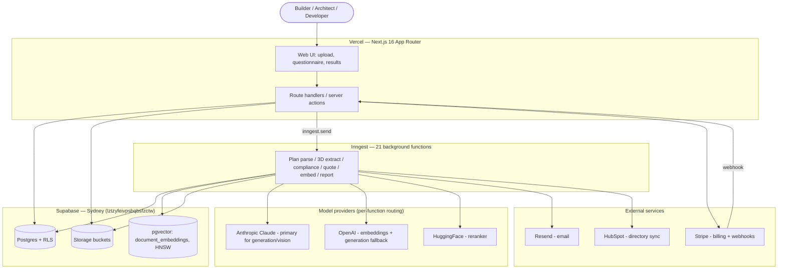

# High-Level Design (HLD) — MMC Build Platform

> **Document type:** Architecture reference (living document)
> **Repo:** `mmcbuild-ai/mmcbuild-application`
> **Status:** `VERIFIED — 2026-06-30` (verified against deployed code; see §11 corrections summary)
> **Owner:** Dennis McMahon (technical lead)
> **Last updated:** 2026-06-30
> **Companion doc:** `docs/LLD.md` (implementation detail)

---

## How to read this document (verification convention)

This HLD describes **what the system is and how the major pieces fit together**. It is reference, not instruction — it does not tell an agent to *do* anything; it tells the reader how the thing *works*.

Claims carry one of three states:

| Marker | Meaning |
|---|---|
| `[A]` ASSERTED | Drafted from PRD / email / memory. **Not** checked against the codebase. |
| `[V]` VERIFIED | Confirmed against deployed code. Cites the file/path that confirms it. |
| `[?]` GAP | Unknown or contested. Needs investigation before it can be asserted. |

The original draft of this document was entirely `[A]`. A full verification pass was run on **2026-06-30** (read-only — no code changed); each claim below was opened against the deployed code and promoted to `[V]` with a file reference or downgraded to `[?]`. **Where this HLD and the PRD disagree, deployed code wins** — the disagreement is flagged rather than silently resolved.

> **On PRD §4 (AWS/Azure) — not a contradiction:** The agreed and contracted build stack is **Vercel + Supabase + Inngest**, per the accepted quotation GBTA-MMC-2026-001. PRD §4's AWS/Azure architecture is the **contemplated post-MVP enterprise migration path**, deliberately kept reachable by choosing an open-source, low-vendor-lock-in stack (Next.js + PostgreSQL). It is a documented future-state target, **not** the MVP build target. This HLD documents the contracted/deployed MVP stack. `[V]` — no AWS/Azure/FastAPI service exists in the repo (see §4).

---

## How to reuse this file as a template (portfolio-wide)

This file is structured to be copied into any repo in the portfolio:

1. Copy `docs/HLD.md` + `docs/LLD.md` into the new repo's `docs/` folder.
2. Find-and-replace the repo/project identifiers in the header block and §3.
3. Reset all markers to `[A]` and re-run the verification pass against *that* repo's code.
4. Keep section headings identical across repos so the docs are comparable and an agent knows where to look.

Keep the section headings even if a section is empty in a given repo — write `*Not applicable to this repo.*` rather than deleting the heading.

> **Keep-it-current convention (enforceable — Karthik Rao, 29 Jun 2026):** any feature PR that adds or changes a route, an Inngest function, a schema/migration, an external integration, or an AI-routing decision **must add or update the relevant HLD/LLD entry as part of its own Definition of Done.** A PR that changes the architecture without updating these docs is incomplete. The marker convention makes this auditable: a new claim lands as `[A]`, and the same PR promotes it to `[V]` with the file it just wrote.

---

## 1. System overview & purpose

`[V]` MMC Build is an AI-native multi-tenant SaaS for the Australian modular and manufactured construction (MMC) sector. It ingests building plans, runs AI analysis against the National Construction Code (NCC) and against cost/design knowledge bases, and returns compliance reports, design-optimisation suggestions, cost estimates, a verified trade directory, and training modules. *(Verified by the six live module directories under `src/app/(dashboard)/` — see §3 — and the multi-tenant org/RLS model in `supabase/migrations/00001_foundation.sql`.)*

`[V]` AI outputs are advisory, not certified — human-in-the-loop validation is a core product principle, with traceable citations to NCC clauses. *(Compliance retrieval attaches NCC source chunks via the hybrid RAG retriever `src/lib/comply/retriever.ts`; honest-error handling in `src/lib/ai/extract-json.ts` and `src/lib/ai/provider-errors.ts` enforces evidence-before-diagnosis.)*

---

## 2. Architecture (component view)

> `[V]` Synchronous vs. async boundary confirmed: each module's **server action** runs auth + a DB write **inline**, then dispatches the heavy work to Inngest via `inngest.send(...)` (`comply/actions.ts:131`, `build/actions.ts:81`, `quote/actions.ts:50`, `train/actions.ts:679`). All AI generation, plan parsing, 3D extraction, embedding, and report generation run in Inngest functions, not in the request path (Vercel route handlers have a 10s ceiling; the Inngest serve route lifts `maxDuration = 300`). MMC Direct CRUD and Billing actions run inline; Direct uses Inngest only for notifications, Billing only for the webhook-driven Stripe sync.

---

## 3. Modules (bounded contexts)

`[V]` All six modules live under `src/app/(dashboard)/<module>/` with an `actions.ts` server-action file:

| Module | Route | Actions file | Async job (Inngest) |
|---|---|---|---|
| **MMC Comply** | `/comply` | `src/app/(dashboard)/comply/actions.ts` | `run-compliance-check` |
| **MMC Build** | `/build` | `src/app/(dashboard)/build/actions.ts` | `process-plan`, `run-design-optimisation`, `extract-design-attributes`, `run-test-3d-extraction` |
| **MMC Quote** | `/quote` | `src/app/(dashboard)/quote/actions.ts` | `run-cost-estimation` |
| **MMC Direct** | `/direct` | `src/app/(dashboard)/direct/actions.ts` | notifications only: `notify-new-professional`, `send-enquiry-notification`, `send-review-notification` |
| **MMC Train** | `/train` | `src/app/(dashboard)/train/actions.ts` | `generate-training-content`, `issue-training-certificate` |
| **Billing** | `/billing` | `src/app/(dashboard)/billing/actions.ts` | webhook-driven `sync-stripe-subscription` (no `inngest.send` in the action) |

| Module | Responsibility | Primary inputs | Primary outputs |
|---|---|---|---|
| **MMC Comply** | NCC compliance assessment | Plan PDF + questionnaire | Compliance report with NCC citations + risk flags |
| **MMC Build** | Design optimisation + 3D extraction (constructability, prefab/SIP) | Plan + questionnaire | Original vs. optimised view; 3D model; exports |
| **MMC Quote** | Cost estimation | Plan area (GFA) + region | Costed estimate (market rates vs. data-gap flags) — see `LLD.md` |
| **MMC Direct** | Verified trade/consultant directory | Org/profile data, ABN/licence | Filterable verified listings; HubSpot sync |
| **MMC Train** | Self-paced MMC training | Course content | Progress tracking, completion certificates |
| **Billing** | Subscription & invoicing | Stripe events | Subscription state, usage limits |

> **Correction folded in:** the CLAUDE.md module map labelled Build's job `run-build-check` and Quote's `run-cost-estimate`. Neither id exists. Build runs `process-plan` (+ `run-design-optimisation`, `extract-design-attributes`, `run-test-3d-extraction`); Quote's function id is **`run-cost-estimation`** (`src/lib/inngest/functions/run-cost-estimation.ts:52`).

---

## 4. Tech stack

`[V]` Version pins read off the root `package.json` (pnpm; `"private": true`):

| Layer | Technology | Pin / detail |
|---|---|---|
| Frontend | Next.js (App Router), React, TypeScript | `next 16.1.6`, `react`/`react-dom 19.2.3`, `typescript ^5` |
| Server | Next.js route handlers / server actions | **No separate Node/Python/FastAPI service** — single Next.js app. PRD's FastAPI is not present. `serverActions.bodySizeLimit: 100mb` (`next.config.ts`) for large plan uploads |
| Database | Supabase Postgres (Sydney) | `@supabase/supabase-js ^2.98.0`, `@supabase/ssr ^0.8.0`. Project `lztzyfeivpsbqbsfzctw` |
| Vector / RAG | pgvector | Extension enabled `00001_foundation.sql:11`; table `document_embeddings VECTOR(1536)`, **HNSW** index (`vector_cosine_ops`, m=16, ef_construction=64) `00002_comply.sql:155-175` |
| Object storage | Supabase Storage | ~5 buckets created in migrations (~8 bucket names in use); `storage.objects` RLS policies — see §8 |
| Background jobs | Inngest | `inngest ^3.54.0`; **21 functions** registered in `src/app/api/inngest/route.ts`; client `src/lib/inngest/client.ts` (`id: "mmcbuild"`) |
| LLM (generation/vision primary) | Anthropic Claude | `@anthropic-ai/sdk ^0.78.0`; `claude-sonnet-4-6` primary, `claude-haiku-4-5-20251001` for cheap/classify |
| LLM (embeddings + fallback) | OpenAI | `openai ^6.25.0`; `text-embedding-3-small` (1536 dims) for embeddings; `gpt-4o` / `gpt-4o-mini` as generation **fallback** (and `gpt-4o` is the *primary* for compliance cross-validation) |
| Reranking | HuggingFace | `BAAI/bge-reranker-v2-m3` (registry `src/lib/ai/models/registry.ts`) |
| Email | Resend | `resend ^6.9.3`. Transactional |
| Billing | Stripe | `stripe ^21.0.1` (server), `@stripe/stripe-js ^9.0.0` (client) |
| CRM/Directory sync | HubSpot | via `sync-hubspot-listing` Inngest function |
| Hosting / CI/CD | Vercel | No `vercel.json` / `vercel.ts`; config via `next.config.ts` + `maxDuration` export. Team `team_DquayrHfy4FCoeViJMWU7fIq`; project `mmcbuild-application` |
| 3D | three.js | `three ^0.183.2`, `@react-three/fiber ^9.5.0`, `@react-three/drei ^10.7.7` |

> `[V]` **LLM routing answer (open question 2).** Routing is **per-AI-function fallback chains** in `src/lib/ai/models/router.ts` (`ROUTING_TABLE`) + `registry.ts`, not a single primary/fallback pair. `callModel(fn, options)` walks the chain in order, advancing to the next model on a thrown provider error and logging usage (incl. cache + fallback flag) to `ai_usage_log`. Key chains:
> - `compliance_primary`: `claude-sonnet-4-6` → `gpt-4o` → `claude-haiku-4.5`
> - `compliance_validator` (cross-validation): `gpt-4o` → `claude-haiku-4.5` → `gpt-4o-mini` (**OpenAI is primary here**)
> - `design_primary`, `cost_primary`, `training_content`, `plan_vision`: `claude-sonnet-4-6` primary, `gpt-4o` fallback
> - `embedding`: `text-embedding-3-small` only (no fallback); `reranking`: `bge-reranker-v2-m3`
>
> **Corrects the quote:** GBTA-MMC-2026-001 specified OpenAI GPT-4 Turbo primary / Claude fallback. Production has **inverted this — Claude (`claude-sonnet-4-6`) is the generation/vision primary**, OpenAI is the fallback (and the embeddings provider). **OpenAI is NOT embeddings-only** — it is the embeddings provider *and* a generation fallback on nearly every chat function. **Prompt caching** (Anthropic ephemeral, `cache_control`) is wired **only on the MMC Comply pipeline** (`src/lib/ai/claude.ts:26`, `src/lib/ai/validation/cross-validator.ts:115`) — not Quote/Build/Train.

---

## 5. Key data flows

### 5.1 Plan analysis (Comply / Build) `[V]`
1. User selects module → uploads plan PDF → server action validates and writes a row, then `inngest.send(...)`.
2. User completes guided questionnaire (mostly choice-based, some free-text); design attributes are auto-derived (`extract-design-attributes`).
3. Inngest does the heavy lifting: parse (`process-plan`) → embed/retrieve (RAG via `match_documents_hybrid`) → model call (`callModel`) → cite → persist → generate report. *(Comply: `run-compliance-check`. Build: `process-plan` + `run-design-optimisation` + 3D extraction.)*
4. Report surfaced in UI; exportable (PDF; Build also renders a 3D model via three.js).

> `[V]` Citations are attached by the compliance retriever returning NCC chunks (`src/lib/comply/retriever.ts`, `enhanced-retriever.ts`); low-confidence / refusal outputs are surfaced honestly via the typed `ModelNonJsonResponseError` (`src/lib/ai/extract-json.ts`) rather than masked.

### 5.2 Quote generation `[V]`
See `LLD.md §1` for the cost-engine mechanics. At HLD level: GFA + region → `requestCostEstimation` writes a `cost_estimates` row (status `queued`) and fires `cost/estimation.requested` → `run-cost-estimation` loads `cost_reference_rates`, computes the whole-module build-up (`computeMmcBuildup`), and stores labelled line items (market-rate green vs. data-gap amber).

### 5.3 Directory sync `[V]`
Org/profile + verification data persisted in Postgres (`professionals` etc., `00021_directory.sql`); synced **outbound** to HubSpot via the `sync-hubspot-listing` Inngest function. Notifications (`notify-new-professional`, enquiry/review) also run async.

---

## 6. External integrations

| Service | Purpose | Direction | Notes / verify |
|---|---|---|---|
| Anthropic `[V]` | Primary generation + vision inference | Outbound | `@anthropic-ai/sdk ^0.78.0`; key ownership migration — SCRUM-232. |
| OpenAI `[V]` | Embeddings (`text-embedding-3-small`) + generation fallback | Outbound | `openai ^6.25.0`; `OPENAI_API_KEY`. |
| HuggingFace `[V]` | Reranking (`bge-reranker-v2-m3`) | Outbound | Registry-declared model. |
| Stripe `[V]` | Billing | Out + webhooks | Webhook → `sync-stripe-subscription`; `stripe ^21.0.1`. |
| Resend `[V]` | Transactional email | Outbound | `resend ^6.9.3`. DKIM gap tracked separately (invite deliverability). |
| HubSpot `[V]` | Directory sync | Outbound | `sync-hubspot-listing`. |
| Inngest `[V]` | Job orchestration | Internal | `inngest ^3.54.0`; account-ownership migration — SCRUM-236. |

---

## 7. Deployment & environments

`[V]` Multi-tenant SaaS on Vercel (frontend + serverless functions), Supabase for data/storage/auth, Inngest for async. AU data residency via Supabase Sydney region (`lztzyfeivpsbqbsfzctw`). Inngest serve route forces `serveHost` to `NEXT_PUBLIC_APP_URL` and lifts `maxDuration = 300` (3D extraction runs 3–4 min).

`[V]` Source: GitHub org `mmcbuild-ai`, repo `mmcbuild-application` (the canonical repo Vercel deploys from; `main` → production auto-deploy).

> `[?]` Environment list (prod/preview/local) and the prod-access ownership model (Karthik owns Vercel/Supabase prod deploy access) are operational facts not determinable from code alone — left as `[?]` pending confirmation from the operator. No `vercel.json`/`vercel.ts` is committed, so environment wiring is held in the Vercel dashboard, not the repo.

---

## 8. Cross-cutting concerns

- **Auth & RBAC** `[V]` — Supabase auth; `getUser()` gate on every data-accessing route (CLAUDE.md pattern). Role model is an **8-value construction-domain hierarchy**, NOT the portfolio's owner/admin/member default: DB enum `user_role = owner, admin, project_manager, architect, builder, trade, viewer, beta` (`00001_foundation.sql:14`, extended by `00013` + `00049`); app helpers in `src/lib/auth/roles.ts` (`ROLE_HIERARCHY`, `canManageMembers`, etc.). There is **no `member` role**. Default role is `viewer`.
- **Row-Level Security** `[V]` — RLS enabled on **62 distinct public tables** (53 `ENABLE` statements) with **~139 `CREATE POLICY` statements on public tables** (57 tables carry ≥1 policy). Org-scoping uses `get_user_org_id()` (`00001_foundation.sql:97`, made active-org-aware in `00059`). **5 tables are RLS-enabled with NO policy by design** (fail-closed, service-role-only): `marketplace_estimate_tokens` (`00046`) + `trust_audit_log` / `trust_metering_events` / `trust_rate_limits` / `trust_permission_policies` (`00047`). This is the intended opaque-token / security-gate lockdown, and exactly matches **SCRUM-231's "5 RLS-locked tables"** — confirmed not a defect. A full sweep found no *other* RLS-on-without-policy table.
- **Storage** `[V]` — **~5 buckets created in migrations** (`kb-uploads`, `site-data`, `directory-uploads`, `training-certs`, `test-screenshots`), with ~3 more bucket names (`plan-uploads`, `engineering-certs`, `remediation-uploads`) created via the dashboard/CLI and policied/used from code. **~17 `storage.objects` RLS policies** (`00003`, `00015`, `00021`, `00022`, `00035`, `00066`). **Correction:** the draft's "~12 buckets, 48 policies" was materially overstated — actual is ~5 buckets created in-migration (~8 names) and ~17 storage policies.
- **Observability** `[?]` — AI usage is logged to `ai_usage_log` (`trackUsage` in the router) — `[V]`. Vercel Analytics + Sentry per the quote/PRD are **not confirmed wired in this pass** (no Sentry SDK found in `package.json`); left `[?]` — flag for a separate ticket if Sentry is required.
- **Security / residency** `[V]` — AU data residency (Sydney region); prompt-injection guard `src/lib/security-gate.ts` runs before user-derived content enters AI prompts; token endpoints (`/api/remediation/[token]`) preserve expiry checks; Stripe + GitHub webhooks verify signatures. Encryption in transit/at rest is provided by Supabase/Vercel managed infra.

---

## 9. Open items linked to this design

`[A]` Tracked in Jira (SCRUM): SCRUM-230 zero-org uploader, SCRUM-232 MMC Build-owned AI accounts, SCRUM-236 Inngest migration, SCRUM-231 RLS-locked tables (verified = 5, by design), SCRUM-234 derive endpoint env var, SCRUM-235 registerPlan swallowed Inngest send, SCRUM-233 migration ledger baseline. *(Jira state not re-checked in this code pass.)*

**Doc-discovered items to raise (no code change made — verification pass is read-only):**
- Sentry/Vercel-Analytics observability is asserted in the quote/PRD but **not found wired** — raise to Dennis to confirm intended vs. aspirational.
- Inngest function naming drift: CLAUDE.md module map says `run-build-check` / `run-cost-estimate`; real ids are `process-plan` / `run-cost-estimation`. Update the CLAUDE.md map.

---

## 10. Verification checklist (status after the 2026-06-30 pass)

- [x] `[V]` Deployed stack = Vercel + Supabase + Inngest (no FastAPI/AWS/Azure). PRD §4 confirmed as post-MVP target, not a contradiction.
- [x] `[V]` Each of the 6 modules mapped to its `src/app/(dashboard)/<module>/` route + actions file (§3).
- [x] `[V]` Sync/async boundary confirmed (actions inline → `inngest.send` → 21 functions).
- [x] `[V]` pgvector confirmed: `document_embeddings VECTOR(1536)`, HNSW index, `match_documents_hybrid` RAG RPC, used by MMC Comply.
- [x] `[V]` LLM routing: Claude primary (generation/vision), OpenAI = embeddings + generation fallback (primary for compliance cross-validation). Prompt caching on Comply only.
- [x] `[V]` RLS confirmed on tenant tables; 5 deliberate RLS-locked tables (SCRUM-231). Storage counts corrected.
- [x] `[V]` Framework/SDK versions pinned from `package.json` (§4).
- [~] `[?]` Observability (Sentry) unresolved; environments/prod-access ownership not code-determinable.

---

## 11. Corrections summary (evidence the pass read the code)

**Confirmed (`[A]` → `[V]`):** Vercel+Supabase+Inngest stack; 6 modules → routes/actions; sync→async boundary; pgvector `document_embeddings` (1536, HNSW) + `match_documents_hybrid`; Claude-primary routing; OpenAI embeddings `text-embedding-3-small`; RLS on tenant tables; 5 RLS-locked tables = SCRUM-231 by design; `get_user_org_id()` helper; all SDK version pins.

**Corrected (claim → actual):**
- "Single LLM primary + fallback; OpenAI embeddings-only" → **per-function routing chains; OpenAI is embeddings AND generation fallback, and primary for compliance cross-validation.**
- "FastAPI / separate service" → **none; single Next.js 16 app.**
- "Inngest `run-build-check` / `run-cost-estimate`" → **`process-plan` (+ others) / `run-cost-estimation`.**
- "owner/admin/member roles" → **8-role construction hierarchy; no `member` role.**
- "Storage ~12 buckets, 48 policies" → **~5 buckets in-migration (~8 names), ~17 storage.objects policies.**
- "pgvector ivfflat (assumed)" → **HNSW.**

**Still `[?]` (gaps):** Sentry/Vercel-Analytics instrumentation (not found, may be aspirational); environment list + prod-access ownership (operational, not in repo); Jira ticket states (not re-checked in a code pass).
